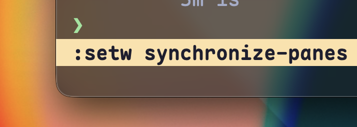
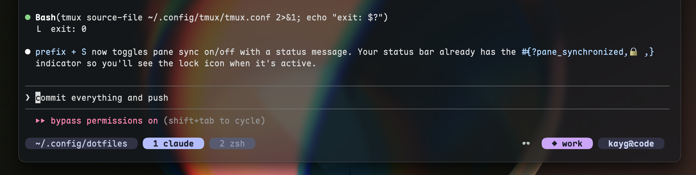
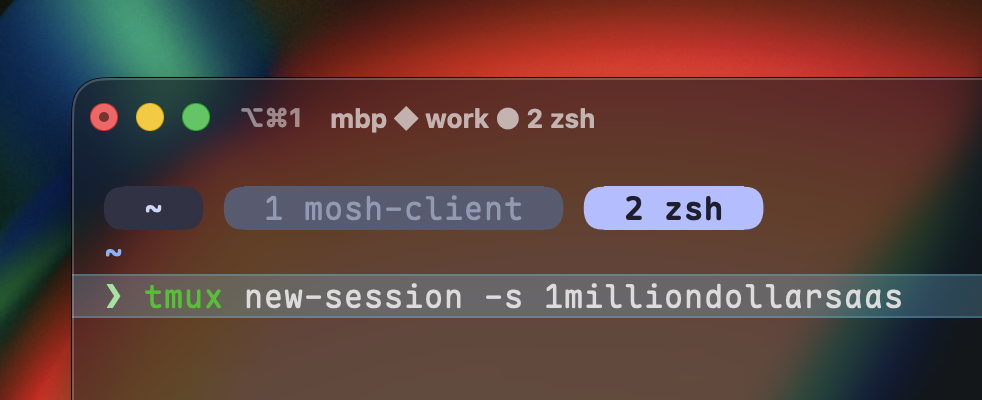
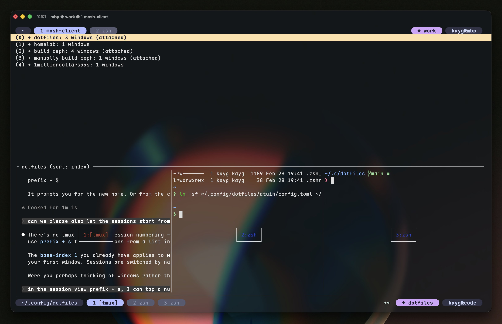
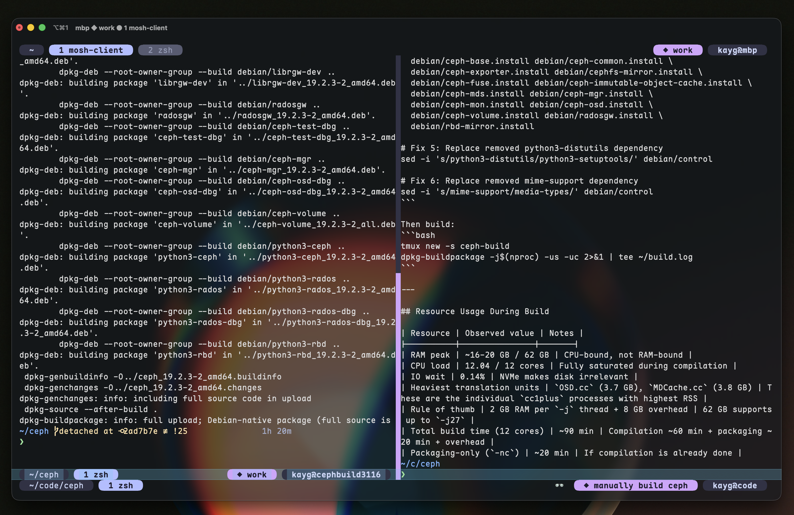

2026 is the year of the terminal 💻

Since everybody and their grandmother is now vibe-coding apps, this is a series on how to use tmux better so you can remotely manage your long-running, vibe-coding, zip-zappin agent anywhere in the world.

This hashtag #100DaysOfTmux and the series of posts are available to view on X/twitter, Threads, Mastodon and Bluesky.

## Day 1

instead of using your terminal (iterm2, ghostty, kitty, etc) native shortcuts, learn the tmux ones - they pay off when you run tmux on a remote host.

→ tmux cheatsheet ←

if you ever get stuck not knowing how to do something, use the prefix + ? to look at the in-built cheatsheet, press / to search, n to search forward / N backward.

bonus: you can also customise the cheatsheet to include the custom keybindings, categories; even make it scrollable and zoomable!

## Day 2

### 1 / 3

You can synchronise panes to save time spent on typing commands.

Simply do:

`Prefix + :` → `setw synchronize-panes`

You can make it easier by assigning a keybinding.

My take?

`Prefix + (capital) S` cuz it just makes sense and that's also what you see in the video. ⇣

### 2 / 3

You can sync to save time, de-sync to make edits and sync back again.

### 3 / 3

BONUS: I use this everyday to spin up multiple vms at once using ansible for tasks like build VMs, throwaway VMs or even adding more kubernetes nodes to my clusters.

If you are unsure on how to set the keybinding up, you can ask claude code to set it up for you.

## Day 3

### 1 / 5

today we learn about sessions

a tmux session holds a group of windows which in turn hold a group of panes

it goes like: sessions → windows → panes

sessions are what you create with:

→ tmux new-session -s 1milliondollarsaas

OR

→ tmux new -s 1milliondollarsaas

### 2 / 5

while inside a session, you can create a new one by pressing:

→ `prefix + C-c` (control + c)

so if your prefix is `Control + b`, you press:

→ `Control + b` and then `Control + c`

### 3 / 5

if you want to navigate all the active sessions, that starts with the prefix too:

→ prefix + s

from there on, you can either move up and down or hit the number displayed on the left directly to open the session or a window within that session

### 4 / 5

while moving between sessions in the list, you also get a nice preview of what windows the session currently has.

### 5 / 5

BONUS: use sessions for projects, windows within sessions for different parts of the project and panes for when you need to reference or do tasks in parallel.

## Day 4

Even though tmux is a terminal program, you can resize panes by dragging around like it's a proper window. Make sure you have the following in your config:

set -g mouse on

my config for reference: https://github.com/kaygdotorg/dotfiles/blob/14cb06039a09d95a867df55a4510e75b3afb282c/tmux/.tmux.conf#L22

## Day 5

If you have got a split pane but it's too tiny, you can always resize it (see: Day 4) BUT you can also move it into its own window.

In tmux, the cmd is called: tmux break-pane

the shortcut: `prefix + (exclamation mark)` as in `prefix + !`

## Day 6

Much like window resizing via mouse (seen in Day 4), you can just... click around.

Wanna goto window 1? yeah: `prefix + 1`

BUT ALSO

have you tried simply clicking on window 1's tab?

it also works inside ssh and nested sessions too!

# Day 7

yeah, you can split panes in tmux but what if you wanna turn a vsplit into a hsplit or vice versa? 

you can press: `prefix + space` 

and cycle between these layouts easy

→ even horizontal
→ even vertical
→ main horizontal
→ main vertical
→ equal

